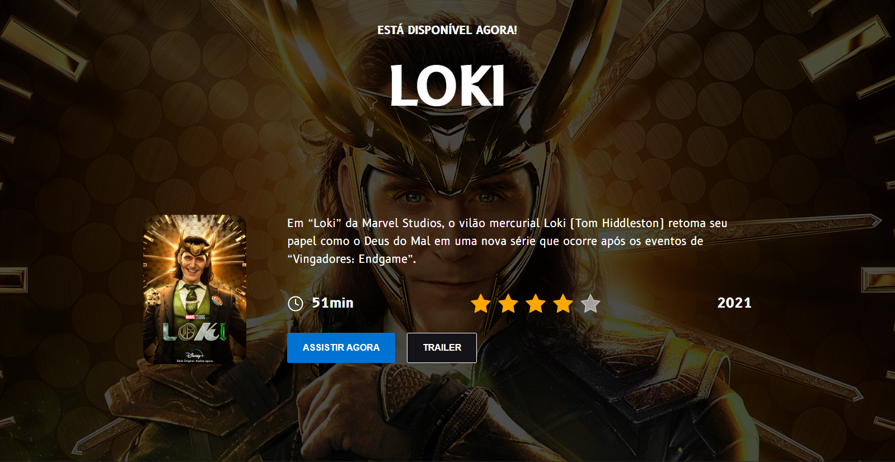
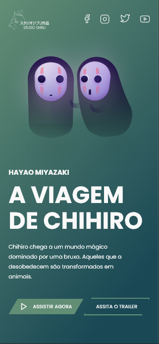
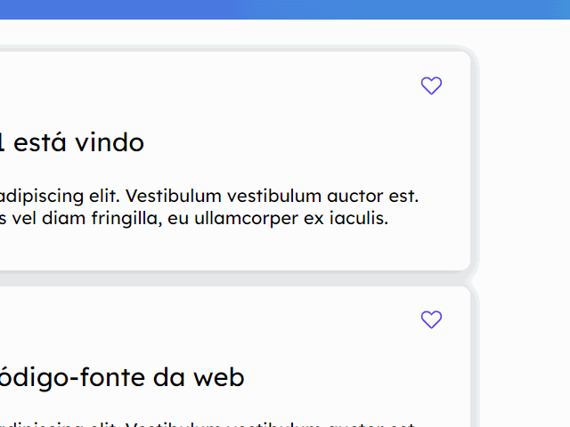
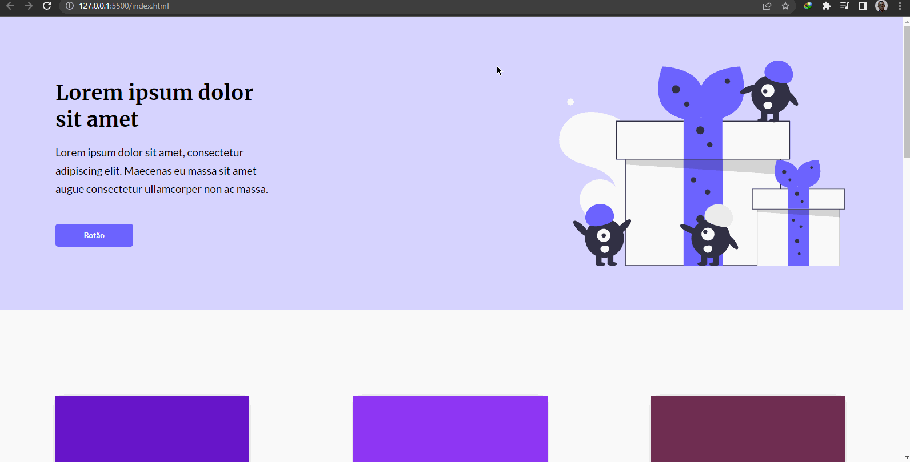
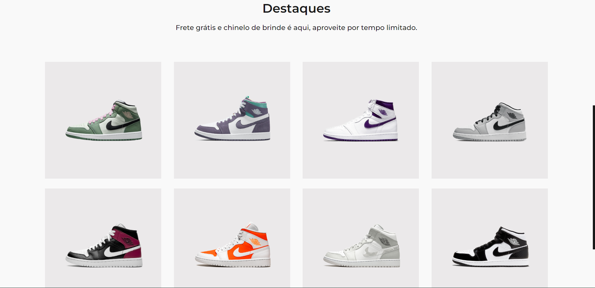

## Desafios - Codelândia

* A <strong>Codelândia</strong> é uma comunidade do Discorde onde o criador <strong>`Iuri Silva`</strong> (@iuricode) posta semanalmente páginas em um único projeto no Figma para poderem ser desenvolvidos pelos participantes da comunidade, mas está aberto a qualquer um com o link.
* Você também pode participar pelo link no perfil do criador <strong>Iuri Silva `@iuricode`</strong>.
* Link do Figma com os projetos: https://www.figma.com/file/Yb9IBH56g7T1hdIyZ3BMNO/Desafios-Codel%C3%A2ndia

<h3 align="center">Meus projetos</h3>

* Cada uma dessas pastas corresponde a um dos desafios da Codelândia que eu desenvolvi da forma que a meu ver é a melhor possível com o conhecimento que tinha no período em que foi desenvolvida, como é um projeto aberto para modificações, em cada um implementei algo, efeitos, animações, modais entre outras que podem ser vistas dentro dos projetos.

<h3 align="center">Alguns projetos que você verá:</h3>

