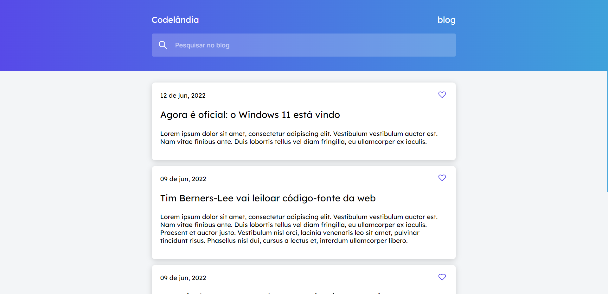
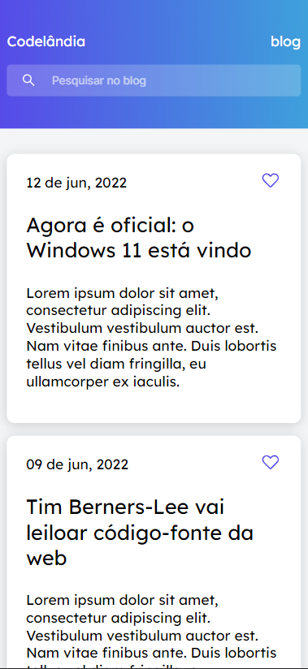
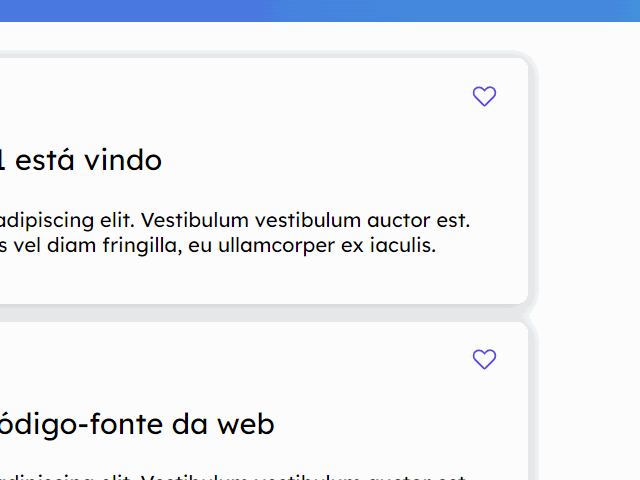

## Desafio 01 - Blog Codelândia

*	Esse é o primeiro desafio da comunidade do Discord Codelândia, onde foi requisitado a criação de um blog.
*	Foram utilizadas as tecnologias ,  e .
*	Como implementação optei por fazer com que o usuário possa <strong>curtir e discutir<strong> qualquer post.

*	Vale ressaltar os posts são carregados por um arquivo JavaScript onde contem cada post como um object que é retornado em tela usando a função <strong>for</strong>.

*	Esse processo de curtir e discutir foi um dos que mais senti dificuldades, porém, pude contornar com uma solução de uma experiencia anterior com um botão ativável de dark mod. Criando uma <strong>checkbox</strong> e mudando os styles quando checkbox:<strong>checked</strong> foi possível fazer com que quando o usuário clicar (checked) atribua uma propriedade <strong>fill</strong> mudando a cor do ícone.