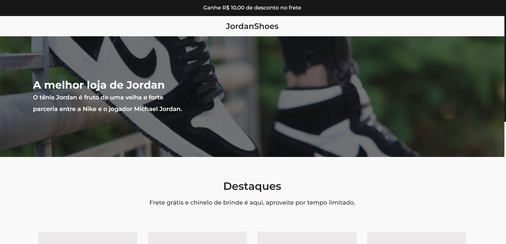
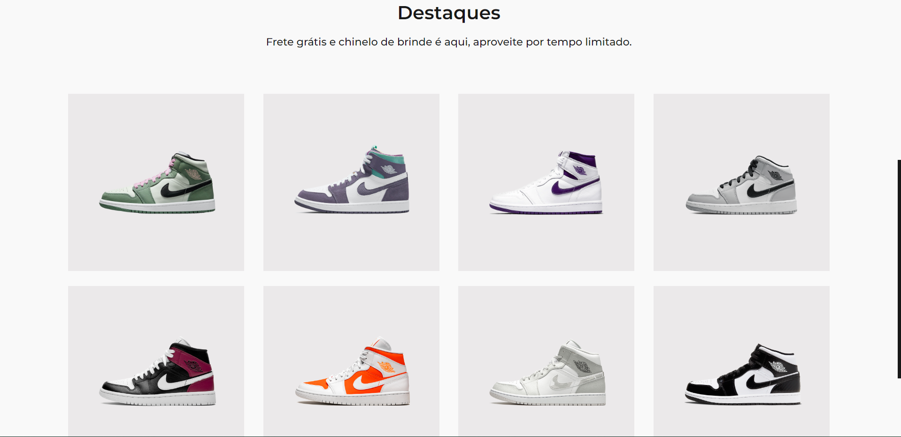
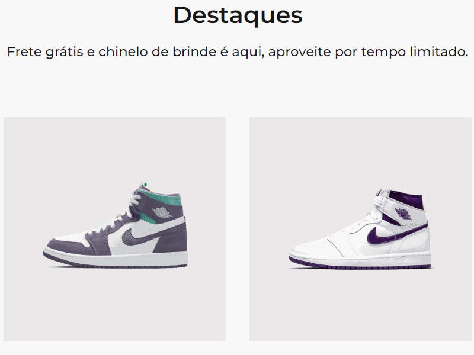

## Desafio 02 - Jordan Shoes

* Esse é o 2º desafio da comunidade o Discord <strong>Codelândia</strong>, onde foi requisitado a criação de um site apresentando os tênis da linha Jodan - Nike.
* Foram utilizadas as tecnologias:

* Vale ressaltar que os cards dos tênis são carregados por um arquivo JavaScript onde contem cada card como um object que é retornado em tela usando a função <strong>for</strong>.

<h3 align="center">--- Mobile Version ---<h3>

* Como implementação optei por criar um efeito de zoom, para isso usei as propriedades de estilo <strong> -webkit-transform: scale(1.1)</strong> para mudar a escala do objeto quando posicionar o mouse sobre ele, e <strong>-webkit-transition: transform .4s ease-in-out</strong> para ajustar o tempo desse efeito.
* Também foi implementado o modelo do tênis como <strong>title</strong>, assim, ao posicionar o mouse sobre a imagem ele mostrará o modelo correspondente ao tênis.

