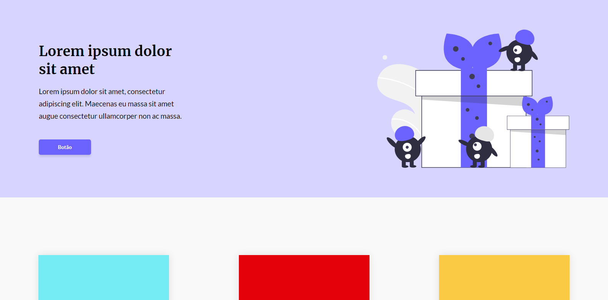
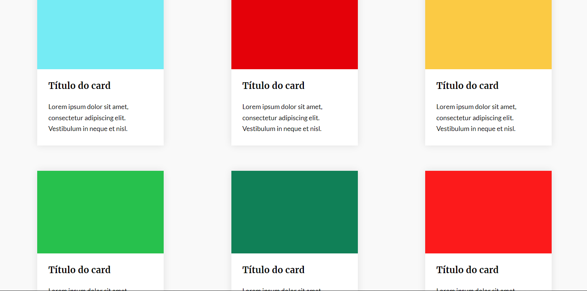
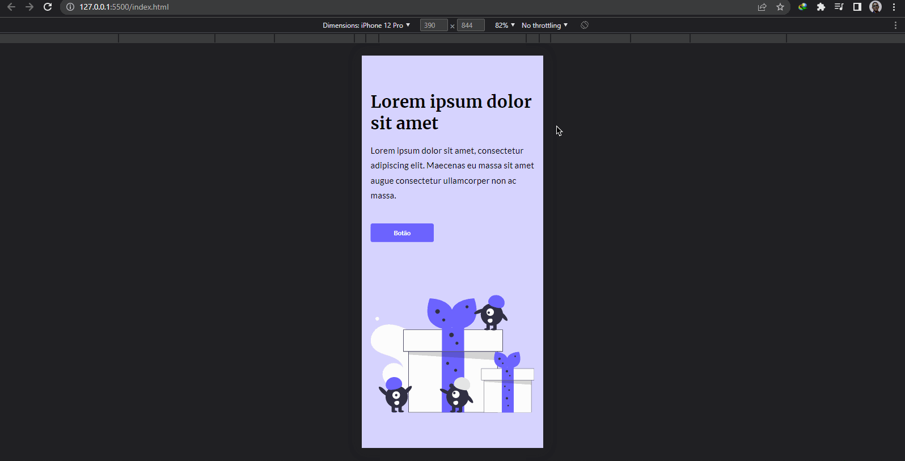
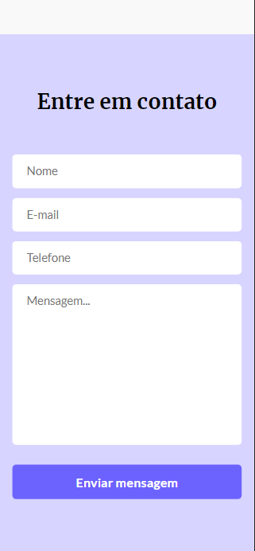
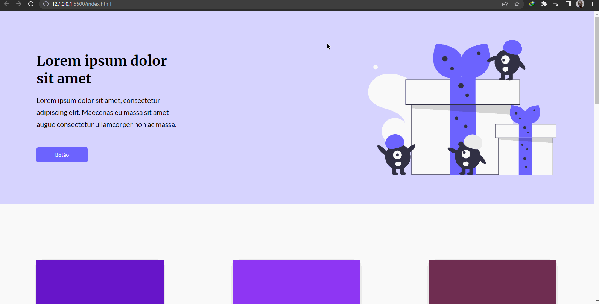

## Desafio 03 - One Page

* Esse é o 3º desafio da comunidade <strong>Codelândia</strong> do Discord, onde foi requisitado a criação de um site com vários cards informativos.
* Foram utilizadas as tecnologias:


* Vale ressaltar que os cards são carregados usando a função <strong>`for`</strong> no arquivo JavaScript, não foi criado um Array contendo cada informação de cada card pois todos os cards tem a mesma informação mudando somente a cor dos cards.

<p align="center"></p>
<p align="center"></p>
<h3 align="center">--- Mobile Version ---<h3>
<p align="center"></p>
<p align="center"></p>

* Como implementação optei por fazer com que seja gerada um cor aleatória para cada card todas as vezes que houver um reload na página como pode ser visto na function abaixo.

```tsx
  function generateColor() {
    const letters = '0123456789ABCDEF';
    let color = '#';
    
    for (let i = 0; i < 6; i++) { // o loop tem que ser de 6x pois uma cor no formato HTML tem 6 caracteres, ex.: #6C63FF
    //nessa function ela busca na const letters uma letra ou número
    //Math.floor => retorna um número inteiro.
    //Math.random => retorna um número randômico
      color += letters[Math.floor(Math.random() * 16)];
    }
    return color;
  }
```

<p align="center"></p>