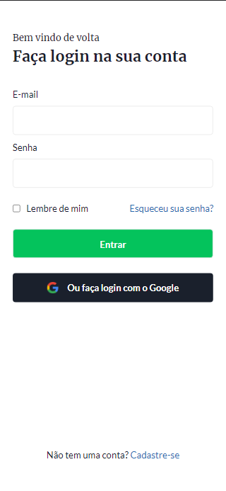

## Desafio 04 - Login

* Esse é o 4º desafio da comunidade <strong>Codelândia</strong> do Discord, onde foi requisitado a criação de uma tela de login.
* Foram utilizadas as tecnologias:

<h3>O resultado foi esse:</h3>

<h3 align="center">--- Mobile Version ---<h3>

