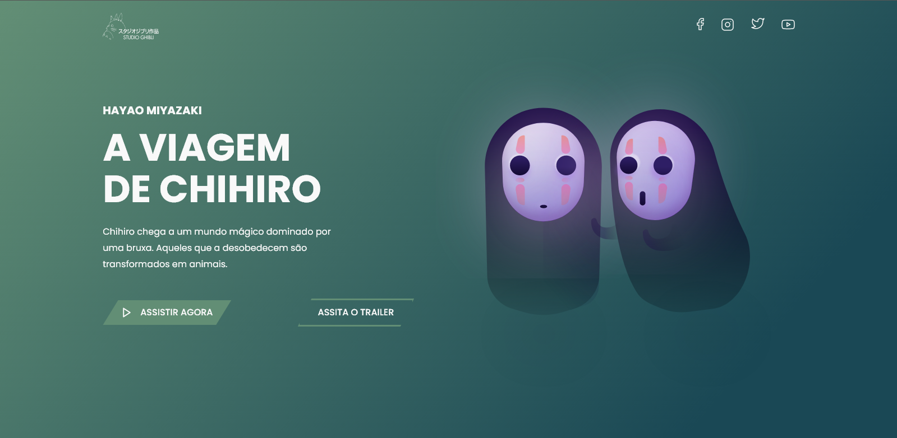
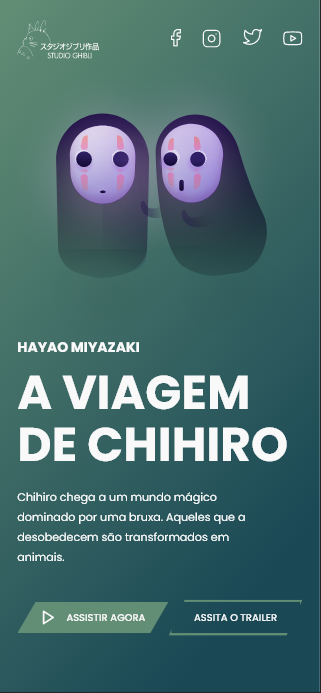

## Desafio 05 - Studio Ghibli

* Nesse 5º desafio da comunidade <strong>Codelândia</strong> do Discord, foi apresentado um projeto de uma lading page sobre o filme A viagem de Chihiro, filme esse que ganhou oscar de <strong>melhor animação</strong>.
* Foram utilizadas as tecnologias:

* Como implementação optei por criar um modal onde o trailer do filme é exibido em tela ao apertar o botão Assistir Trailer.

<h3 align="center">---- Modal com o trailer ----</h3>

<h3 align="center">--- Mobile Version ---<h3>

* É importante ressaltar que como o vídeo que foi usado é diretamente do YouTube não foi possível controla-lo para que parasse a reprodução quando saísse do modal. Para contornar foi usado a função <strong>`location.reload()`</strong> fazendo que todas as vezes que clicar no botão fechar a página seja recarregada.
