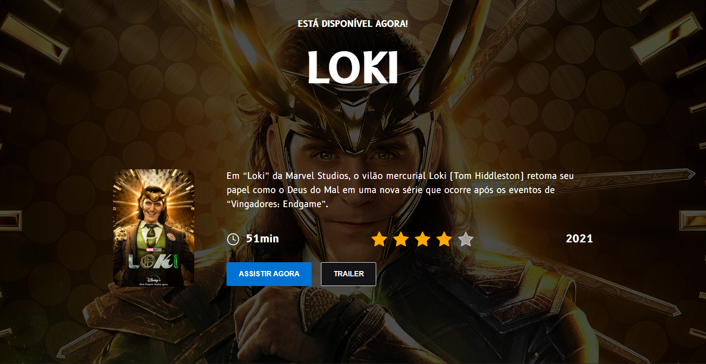
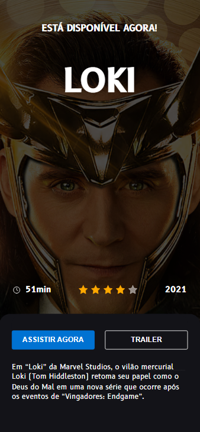

## Desafio 06 - Loki

* Esse é o 6º desafio da comunidade <strong>Codelândia</strong> do Discord, onde foi requisitado a criação de uma lading page com uma aparência semelhante de um streaming de filmes, tendo como filme Loki.
* Foram utilizadas as tecnologias:

* Vale ressaltar que as versões web e mobile tem algumas alterações como pode ser observado que o card com a capa do filme do Loki some na versão mobile e criasse um campo na parte inferior e a descrição que no modelo web fica mais acima no modelo mobile fica em outra posição, além disso, os botões ganham o mesmo tamanho na versão mobile.

<h3 align="center">--- Mobile Version ---<h3>

* Como implementação optei por criar um modal onde o trailer do filme é exibido em tela ao apertar o botão Trailer.

*  O que considerei mais complicado no processo de criação foi as várias mudanças entre o modelo web e mobile.