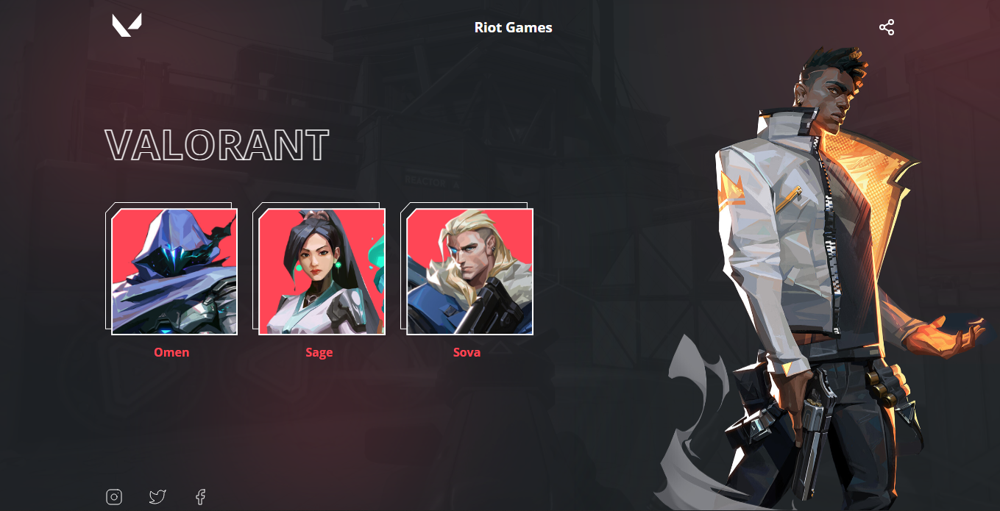
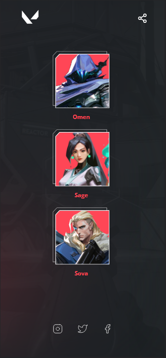

## Desafio 07 - Valorant

* Nesse 7º desafio da comunidade <strong>Codelândia</strong> do Discord, foi apresentado o projeto de uma página do game Valorant desenvolvido pela Riot Games.
* Foram utilizadas as tecnologias:

* A página conta com a apresentação simplificada de alguns champions, hiper links para as redes sociais e compartilhar página.
* Os cards são gerados por meio do JavaScript, retornam as imagens dos cards e o nome de cada champion correspondente.

<h3 align="center">---- Mobile Version ----</h3>

* Como implementação criei um efeito de zoom ao passar o mouse sobre os cards dos champions como pode ser vista na gif abaixo.

