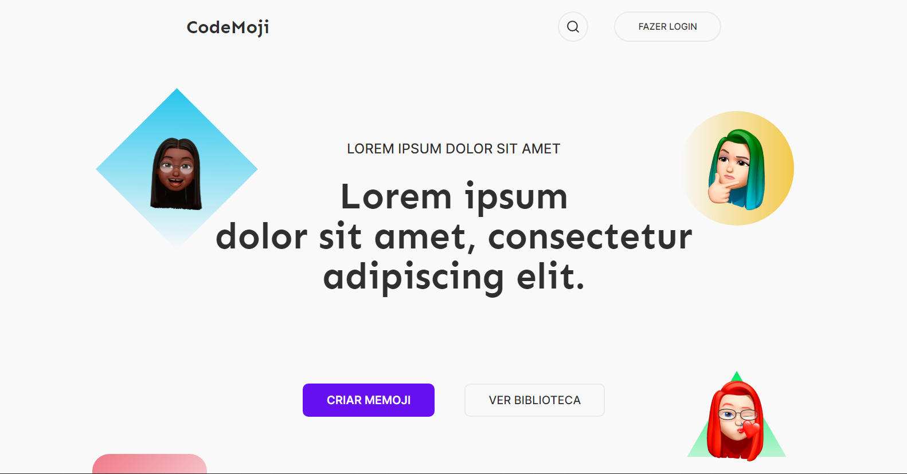
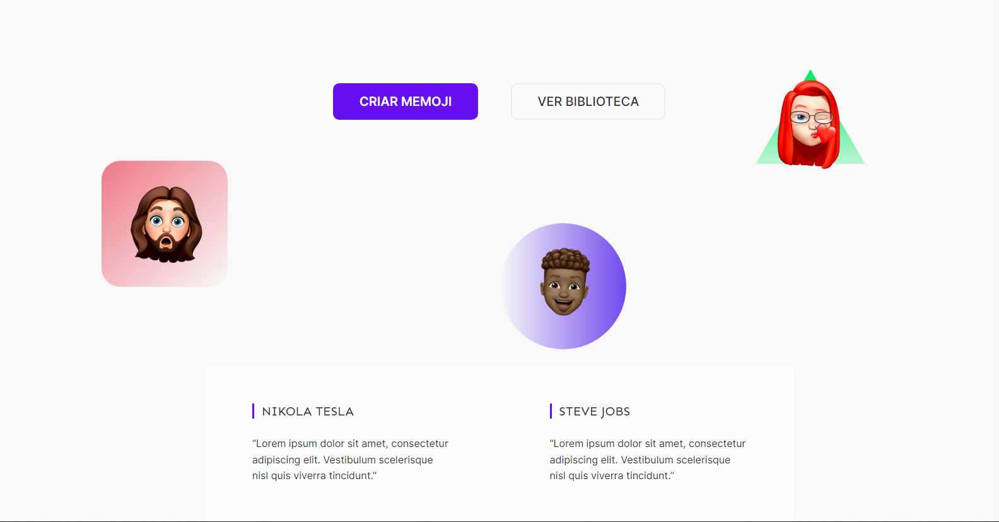
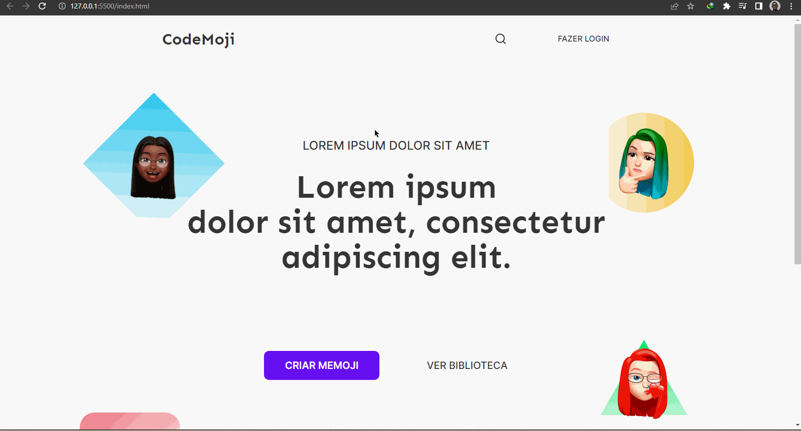
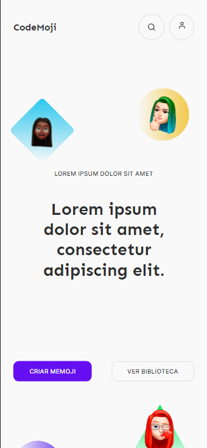

## Desafio 08 - CodeMoji

* Nesse 8º desafio da comunidade <strong>Codelândia</strong> do Discord, foi apresentado a proposta de uma página de apresentação de uma biblioteca.
* Foram utilizadas as tecnologias:

* A página é um modelo de um site de apresentação de uma biblioteca, assim, não contem textos reais sobre o assunto.
* Vale ressaltar alguns detalhes interessantes sobre esse projeto, como as imagens flutuantes em meio a página. Além disso também temos mudanças no modelo mobile, o botão `Fazer Login` se transforma em um ícone, e a 3° imagem já não aparece nesse modelo.

<h3 align="center">---- Mobile Version ----</h3>

